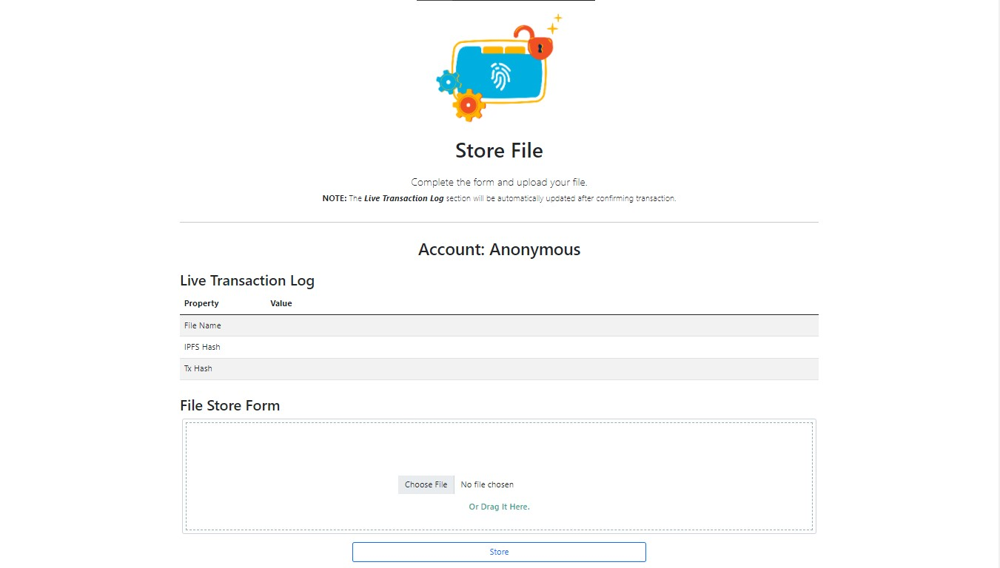

# Docs Universe

Docs Universe is a web based Dapp that allows to store important assets on IPFS instance. Ownership of files is securely recorded on the Ethereum blockchain making it the best platform to store assets

  

## Features

The store feature is a feature for uploading
files to IPFS which is both a create operation on the application
and write operation on the blockchain. The ownership feature
can check the ownership of the uploaded file while allowing
users to be able to retrieve files that have been saved, this is an
implementation of read operations on the application and on
the blockchain. The transfer feature allows users to be able
to make ownership transfers of files that have been previously
stored, this illustrates the implementation of update operation on
the application and write operation on the blockchain.

Store

In the Store feature, system flow starts from the Metamask
check for account selection. Furthermore, the user can perform
store operation by affixing the file to the form on the web
interface, the application then converts the file into a buffer,
user confirms the transaction and proceed with storing the
file to IPFS. As output, the user will get information in the
form of file hash and transaction hash.

  

Ownership

Furthermore, the functionality of the Ownership feature is
also started by checking the Metamask account. Followed by
the choice of whether the user wants to check the ownership
of a file or not. If so, the user can add the file that he wants to
find out the owner of, but if the user does not want to check
the ownership then the user can continue with the file retrieval
feature. In the file retrieval feature, users only need to click
the “Retrieve” button to retrieve the files they own.

  

Transfer

As in the previous featurse flow, the Transfer feature also
starts with a Metamask account check. Then users who wish to
transfer ownership of their files can provide information on the
destination account to be transferred, followed by confirming
the transaction. The end result of this feature is the loss of
the file entry that has been transferred and the receipt of the
transfer transaction hash as proof that the ownership has been
transferred. 

  

## Tech Stack

- Blockchain: Ethereum
- Smart Contract: Solidity ^0.8.0
- Front-end: React Truffle Box + web3.js + Boostrap 
- IPFS: ipfs-api + Infura
 
## Deployment

Execute the steps below sequentially.

npm

From **client** directory: `npm install`

Truffle Compile and Migrate

- Modify truffle-config.js as per your requirement

Then from root folder:
- Ganache Deploy: `truffle migrate --network ganache --reset --compile all`
- Rinkeby Deploy: `truffle migrate --network rinkeby --reset --compile all`

Local Test

`npm start` from *client* directory 
 

